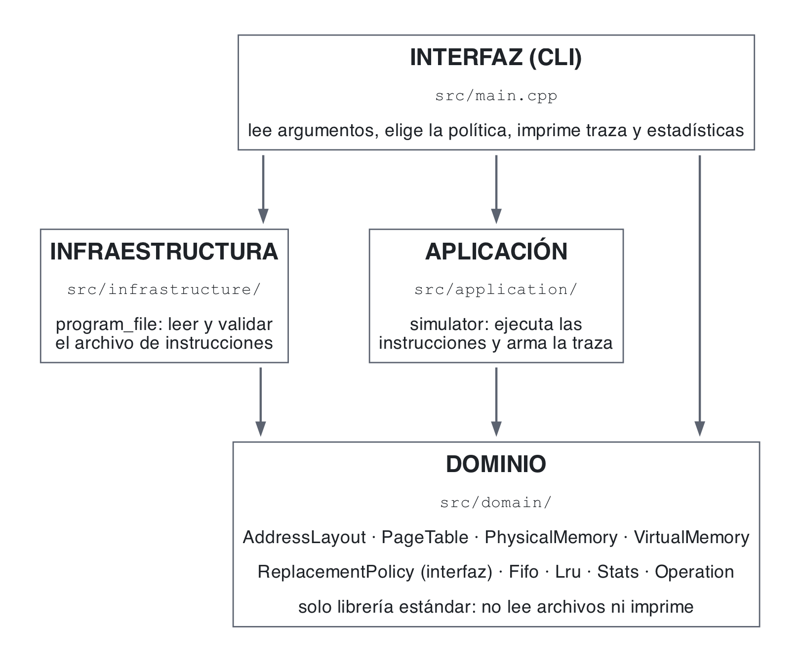

# Simulador de memoria virtual con paginación de dos niveles

Simulador de gestión de memoria virtual (Laboratorio de memoria virtual, Unidad 2, Sistemas
Operativos). Traduce direcciones virtuales de 32 bits a físicas con una tabla de páginas de dos
niveles, atiende fallos de página, y cuando la memoria física se llena aplica una política de
reemplazo (**FIFO** o **LRU**). Al final imprime las estadísticas que pide el enunciado.

El reporte de análisis está en [REPORTE.md](REPORTE.md).

## Compilar, ejecutar y probar

Requisitos: un compilador C++17 (`g++` o `clang++`) y `make`. Sin librerías externas.

```bash
make            # compila -> ./vmsim  (equivale a make all)
make run        # compila y ejecuta data/example.txt con traza
make run PROGRAM=data/ostep.txt
make test       # compila y ejecuta las pruebas (tests/tests.cpp)
make memcheck   # ejecuta bajo valgrind (Linux)
make clean
```

Se compila con `-Wall -Wextra -Werror`: cualquier advertencia rompe la compilación.

```bash
./vmsim data/example.txt                  # FIFO, 256 KB de memoria física, páginas de 4 KB
./vmsim data/example.txt --trace          # además muestra qué pasó en cada instrucción
./vmsim data/ostep.txt lru 12 --trace     # LRU con 12 KB (3 marcos): el ejemplo de clase
./vmsim data/belady.txt fifo 16           # FIFO con 16 KB (4 marcos)
./vmsim data/example.txt lru 256 8        # páginas de 8 KB
```

Uso: `./vmsim <programa.txt> [fifo|lru] [memoria_fisica_kb] [pagina_kb] [--trace]`. Valores por
defecto: `fifo`, `256` KB (el mínimo del enunciado) y `4` KB. La memoria física debe ser un múltiplo
del tamaño de página y este una potencia de dos. Los argumentos se validan por completo (`5x` no se
interpreta como `5`). Códigos de salida: `0` éxito, `1` error de entrada o de ejecución, `2` uso
incorrecto.

**Memoria física menor que 256 KB.** El enunciado pide un mínimo de 256 KB y ese es el valor por
defecto, pero el simulador acepta cualquier tamaño para poder reproducir con pocos marcos los
ejemplos de clase (`12` KB = 3 marcos).

## Formato del programa de entrada

Una instrucción por línea. Se ignoran las líneas vacías y los comentarios (`#`). Los números pueden
ir en decimal o en hexadecimal con prefijo `0x`.

```
alloc <bytes>                  # reserva una región de páginas completas y devuelve su inicio
write <virtual_addr> <value>   # escribe un byte (0-255) en la dirección
read <virtual_addr>            # lee el byte de la dirección
free <virtual_addr>            # libera la región que empieza en esa dirección
```

Reglas:

- `alloc` redondea a páginas completas (`8192` = 2 páginas de 4 KB; `8193` = 3) y entrega las
  regiones una tras otra desde la dirección `0`, como un `sbrk` sencillo. El espacio virtual es de
  32 bits: reservar más allá de `0xFFFFFFFF` es un error.
- Cada dirección guarda **un byte**, por eso `value` va de 0 a 255. Las páginas nuevas llegan en ceros.
- `read` y `write` fuera de toda región reservada son un **segmentation fault**: el simulador se
  detiene con `Error: line N: segmentation fault: 0x... is not inside any allocated region`, como
  haría el sistema operativo con el proceso.
- `free` exige la dirección inicial de una región viva (como `free()` en C). Devuelve a la lista de
  libres los marcos de las páginas de la región que estuvieran en memoria y descarta sus copias en
  disco. El espacio virtual liberado no se reutiliza.
- Cualquier error de formato indica la línea: `Error: line 4: value must be between 0 and 255`.

## Salida

Con `--trace`, una línea por instrucción con la traducción completa:

```
[3] write 0x00000000 <- 42 | VPN 0 (PT1 0, PT2 0, offset 0) | PAGE FAULT: level-2 table created, free frame 0, new page filled with zeros | PA 0x00000000
[5] read 0x00000000 -> 42 | VPN 0 (PT1 0, PT2 0, offset 0) | HIT: frame 0 | PA 0x00000000
[5] read 0x00002000 -> 0 | VPN 2 (PT1 0, PT2 2, offset 0) | PAGE FAULT: evicted VPN 0 from frame 0 (dirty: written to disk), new page filled with zeros | PA 0x00000000
```

Siempre, las estadísticas finales. Las cinco primeras líneas son las del enunciado:

```
Total de accesos: 11
Total fallos de página: 5
Hit rate: 54.55%
Total reemplazos: 2
Política: LRU
Escrituras a disco (páginas sucias expulsadas): 0
Tablas de nivel 2 creadas: 1
Tiempo estimado: 50.0011 ms (100 ns por acceso + 10 ms por fallo o escritura a disco)
Memoria física: 12 KB = 3 marcos de 4 KB
```

- **Hit rate** = (accesos − fallos) / accesos × 100. Solo `read` y `write` cuentan como accesos.
- **Reemplazos** = fallos en los que no había marco libre y hubo que expulsar otra página.
- **Tiempo estimado** usa el modelo AMAT visto en clase (OSTEP cap. 22): cada acceso cuesta
  T_M = 100 ns y cada operación de disco (traer una página o escribir una sucia) T_D = 10 ms.

## Reglas de la simulación

- Dirección virtual de 32 bits. Con páginas de 4 KB: `PT1` = bits 31-22 (1024 entradas),
  `PT2` = bits 21-12 (1024 entradas), `offset` = bits 11-0. Con otro tamaño de página el offset
  toma log2(tamaño) bits y el resto se reparte entre los dos niveles.
- Cada entrada de la tabla (PTE) tiene número de marco y bits `valid`, `accessed` y `dirty`.
  `accessed` se enciende en cada acceso, `dirty` en cada escritura; ambos se apagan al cargar la página.
- La tabla de nivel 2 se crea la primera vez que se accede a una dirección de su rango.
- Fallo de página: si hay un marco libre se usa; si no, la política elige la víctima. Si la víctima
  está sucia se copia al **swap** (disco simulado) antes de expulsarla; si está limpia se descarta.
  La página que llega se llena con ceros, o con su copia del swap si ya había estado en memoria.
- Los marcos libres se entregan en orden (0, 1, 2, ...) para que las trazas sean predecibles.
- **FIFO** expulsa la página que lleva más tiempo en memoria; **LRU** la que lleva más tiempo sin usarse.

## Diseño

```
src/domain/address_layout.h        AddressLayout: cómo se parte la dirección (PT1, PT2, offset)
src/domain/page_table.h/.cpp       PageTableEntry y PageTable de dos niveles
src/domain/physical_memory.h/.cpp  PhysicalMemory: bytes + lista de marcos libres
src/domain/replacement_policy.h    interfaz ReplacementPolicy (4 eventos + choose_victim)
src/domain/fifo.h, lru.h           las dos políticas
src/domain/virtual_memory.h/.cpp   VirtualMemory: alloc/free, translate, handle_page_fault, evict_page, swap
src/domain/stats.h                 contadores, hit rate y tiempo estimado
src/domain/operation.h             una instrucción del programa
src/application/simulator.h/.cpp   run_program(): ejecuta el programa y devuelve la traza como datos
src/infrastructure/program_file.*  read_program(): lee y valida el archivo
src/main.cpp                       argumentos, arma todo, imprime traza y estadísticas
tests/tests.cpp                    pruebas con assert
data/*.txt                         programas de prueba
```

### Capas y regla de dependencia



El diagrama se genera con Graphviz desde `diagram.dot`: `dot -Tpng diagram.dot -o diagram.png`.
Cada flecha es un `#include`. Todas apuntan al dominio y ninguna sale de él. Estos cuatro
comandos no devuelven nada:

```bash
grep -rnE '"(application|infrastructure)/' src/domain   # el dominio no incluye capas externas
grep -rn '"infrastructure/' src/application             # el simulador no conoce el archivo
grep -rnE 'iostream|fstream' src/domain src/application # el núcleo no lee archivos ni imprime
grep -rnE 'Fifo|Lru' src/application src/infrastructure # solo main elige la política concreta
```

- **Dominio.** Las reglas del problema: cómo se parte una dirección, la tabla de dos niveles, la
  memoria física, la traducción con sus fallos y las dos políticas. Solo usa la librería estándar.
- **Aplicación.** `run_program()` recorre las instrucciones, llama a `VirtualMemory` y devuelve
  un `TraceStep` por instrucción. No imprime: la traza son datos.
- **Infraestructura.** El formato del archivo de entrada. Construye `Operation`; el dominio no
  sabe que existe un archivo.
- **Interfaz.** `main.cpp` es el único que conoce las piezas concretas: elige `Fifo` o `Lru`,
  lee con `read_program`, llama a `run_program` e imprime.

### Principios y patrones

**Funciones separadas para traducción, fallos y reemplazo** (requisito técnico del enunciado).
`VirtualMemory::translate` solo traduce; si la PTE no es válida delega en `handle_page_fault`, que
consigue un marco y carga la página; si no hay marcos libres delega en `evict_page`, que pregunta
a la política y desaloja a la víctima. Cada una cabe en pantalla y se prueba por separado.

**Política intercambiable (Strategy, OCP/DIP).** `ReplacementPolicy` tiene cuatro avisos
(`on_load`, `on_access`, `on_release`) y una decisión (`choose_victim`). `VirtualMemory` recibe
un `ReplacementPolicy&` y nunca nombra a `Fifo` ni a `Lru`. Para agregar Clock o Random se
escribe otra clase y se cambia una línea de `main.cpp`; el manejo de fallos no se toca. La
interfaz habla de **marcos**, no de páginas, porque el marco es lo que la política devuelve y lo
que la memoria necesita reutilizar.

**Encapsulamiento.** Las colas de FIFO y LRU, la lista de marcos libres, el directorio de la
tabla de páginas y el swap son privados. Desde fuera solo se puede `alloc`, `free`, `read` y
`write`; el estado se consulta con accesores de solo lectura (`stats()`, `page_table().find()`).

**Sin memory leaks por construcción.** No hay `new` ni `delete`: las tablas de nivel 2 se
crean con `std::make_unique` y se destruyen solas con la tabla; los bytes de la memoria y el
swap viven en `std::vector` y `std::map`. `make memcheck` (valgrind) o, en macOS,
`leaks --atExit -- ./vmsim data/locality.txt` reportan 0 fugas.

**Errores explícitos.** Datos inválidos, accesos fuera de las regiones y usos incorrectos
lanzan excepciones con mensaje y línea; `main` las atrapa y devuelve un código distinto de cero.
Los errores de programación (liberar un marco dos veces, expulsar sin páginas) lanzan
`std::logic_error` como red de seguridad.

**Decisiones y simplificaciones deliberadas.**
- Un byte por dirección. Es lo que hace una memoria real direccionable por bytes y evita
  decidir qué pasa cuando un valor de 4 bytes cruza el límite de una página.
- Un espacio de direcciones (un solo proceso), sin TLB: el enunciado pide traducción, tabla de
  dos niveles, fallos y reemplazo. Un TLB sería otra caché delante de la tabla y no cambia nada
  de lo anterior.
- `alloc` secuencial sin reutilizar el espacio virtual liberado. Con 4 GB de espacio virtual no
  se agota en ningún programa de prueba; lo que sí se reutiliza son los **marcos físicos**.
- La política recibe eventos en vez de leer la tabla de páginas. Eso basta para FIFO y LRU, y
  también para Clock (que puede llevar su propio bit de referencia a partir de `on_access`).
- Se guarda el contenido real de las páginas (memoria y swap). Cuesta unas 20 líneas y hace que
  el bit `dirty` signifique algo verificable: `data/dirty.txt` muestra una página que vuelve del
  disco con el valor que se le escribió.
- LRU exacto con una lista: `O(marcos)` por acceso. Un hardware real usa aproximaciones
  (Clock) porque no puede mover una lista en cada acceso, pero para un simulador con decenas o
  miles de marcos es lo más claro.

## Pruebas

`make test` ejecuta `tests/tests.cpp` (14 pruebas con `assert`): partición de la dirección
(4 KB y 8 KB), creación dinámica de tablas de nivel 2, lista de marcos libres, orden de FIFO y
LRU (incluido `on_release`), el ejemplo del enunciado con sus PTE, segmentation fault, la cadena
de OSTEP (FIFO 7 fallos, LRU 5), la anomalía de Belady (FIFO 9 → 10 fallos con más memoria; LRU
10 → 8), páginas sucias que se escriben a disco y vuelven con su contenido, `free` que libera
marcos y evita reemplazos, tamaño de página configurable, estadísticas y lectura/validación del
archivo con números de línea.

Los programas de `data/` y sus resultados se comentan en [REPORTE.md](REPORTE.md).
